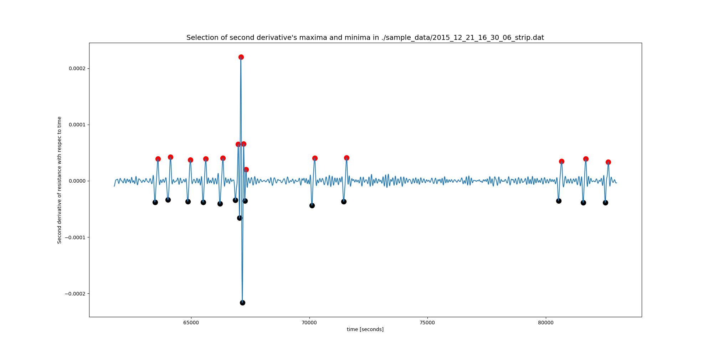

## Automatic analysis of calorimetry runs in radiation dosimetry

### Introduction

This **Python 3** and **Jupyter** notebook-based project wishes to assist the experimental radiation dosimetrist in the analysis of calorimetry runs. In these runs, the calorimeter is heated either by electric current injection or by exposing it to a radiation beam, and
one is interested in measuring the _relative variation of the resistance value_ of a thermistor that is embedded in the body whose temperature variation is under evaluation.

The relative variation of the resistance value of a thermistor is estimated, for _each_ heating run, via a _combined extrapolation_ procedure. The process is described in Pinto (2016) and De Prez (2016). Since the amount of manual operations can result in an extremely tedious and tiring task, a solution is presented here to automate such tasks.

#### Use of the python code (.py)

```bash
$> python3 Core_resistance_analysis.py input_data.dat
```

### How the script works

1. A data file is provided as input, in the form of a two columns, ASCII file. The first column contains the time (for example, in seconds) and the second column must contain the measured values of the thermistor's resistance.

| Seconds	| Resist. (Ohm) |
|--- |--- |
| 0 |	10077.9377 |
| 1 |	10027.2789 |
| 3 |	10027.3288 |
| 5 |	10027.3511 |

2. The experimental data are first filtered for noise (The Butter Low-pass filter from numpy is used), then the first and the second derivatives are calculated, and the minima and maxima of the second derivatives of the data are used to estimate the moment when the heating started and finished, respectively (following a suggestion made by Diego Dreossi, of ELETTRA Synchrothron Trieste).  This figure also shows that not every implementation of the first and second derivation can lead to the wanted results. **To do:** find the filtration that is most applicable.
3. A selection of minima and maxima of the second derivative is necessary to distinguish, and isolate, those minima and maxima that indicate beginnings and ends of each heating run. This is currently based on the absolute value of the maxima and minima: the spurious, additional values that resulted from the filtration of noisy data are considerably smaller than the minima and maxima that one is interested in.  **To do:** this needs improvement, since each input data file may require adjusting the threshold value that identifies the _intended_ minima and maxima.
4. To estimate the pre-heating and post-heating drift trends, on which the double extrapolation methods is based, the regions where the linear fits will be run are identified. 
5. Linear regressions are then carried out, in the regions identified earlier, and the best fit lines are used to forward and back-extrapolate to the mid-point of each heating run, so that the relative resistance variation across each heating run can be estimated (see Pinto, 2016). 
Top panel: forward extrapolations (shown in black) and back-extrapolations (shown in red to the mid-point of each heating run). Bottom panel: the calculated relative resistance changes
6. Data are stored, for further analysis, in a numpy array with the following structure:

| Heating starts (s) | Heating ends (s) | Midpoint (s) | delta_T (s) | pre-heating slope | pre-heating intercept | pre-heating R (Ohm) | post-heating slope | post-heating intercept | post-heating R (Ohm) | delta_R | average R at mid-run | delta_R_over_R | slopes_control |
| --- | --- | --- | --- | --- | --- | --- | --- | --- | --- | --- | --- | --- | ---|
| 1600 | 1720 | 1660 | 120 | 1.04e-4 | 5e-5| 10004.5 | value | value | 10004.22 | 0.255 | 10004.3 | 2.5 e-5 | 0.30367314 |
| 1900 | 2020 | 1960 | 120 | 1.05e-4 | 5.2e-5| value | value | bla | 10002.12 |0.245 | 10004.24 | 2.45 e-5 | 0.2772314 |

where slopes control is a tentative estimator of the thermal equilibrium of the system when passing from the temperature drift that it had before the heating and after heating is completed.
**To do**: Output to a data file for further processing.

**To do** Results from each region should be presented in a grid of individual plots containing a few essential data:


**To do**
The grid would look a little like this:
 
### Reference

1.	Pinto M, Pimpinella M, Quini M, D'Arienzo M, Astefanoaei I, Loreti S, et al. A graphite calorimeter for absolute measurements of absorbed dose to water: application in medium-energy x-ray filtered beams. Phys Med Biol. IOP Publishing; 2016 Feb 21;61(4):1738–64. DOI: [10.1088/0031-9155/61/4/1738](http://dx.doi.org/10.1088/0031-9155/61/4/1738)

2.	de Prez L, de Pooter JA, Jansen B, Aalbers T. A water calorimeter for on-site absorbed dose to water calibrations in 60Co and MV-photon beams including MRI incorporated treatment equipment. Phys Med Biol. IOP Publishing; 2016 Jun 14;61(13):5051–76. DOI: [10.1088/0031-9155/61/13/5051](http://dx.doi.org/10.1088/0031-9155/61/13/5051)
